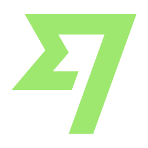

<h1  align="center">Hi 👋, I'm Muhammad Hussain</h1>

  

<h3  align="center">Software Engineer | MERN dev | Building innovative Web & Mobile apps.</h3>

  

  

- 🔭 I'm currently working on [Minute Master](https://minute-master.com/)

  

- 🌱 I'm currently learning **Flutter**

  

- 👨‍💻 All of my projects are available at [my portfolio](https://m-hussain-portfolio.web.app/)

  

- 💬 Ask me about **React, Node, Next and Javascript**

  

- 📫 How to reach me **muhammadhussain99100@gmail.com**

  

- 📄 Know about my experiences [in my resume](https://drive.google.com/file/d/1ZQZqszxzfP2YYsB7yv8P9s_Uo5ecp-9Z/view?usp=sharing)

  

- ⚡ Fun fact **I love playing games.**

  

<h3 align="left">💳 Support my work:</h3>

Pay me using Wise

<!-- 

 -->

<h3  align="left">Connect with me:</h3>

<h3 align="left">Languages and Tools:</h3>

              

