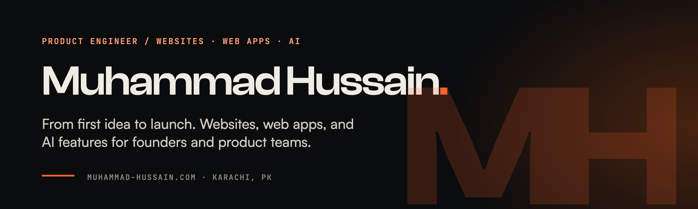
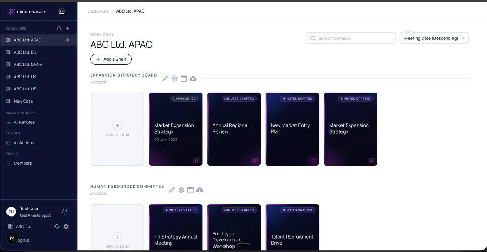
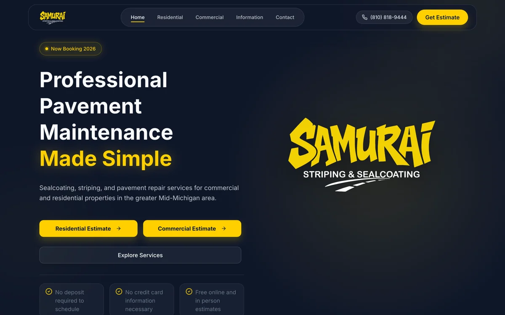
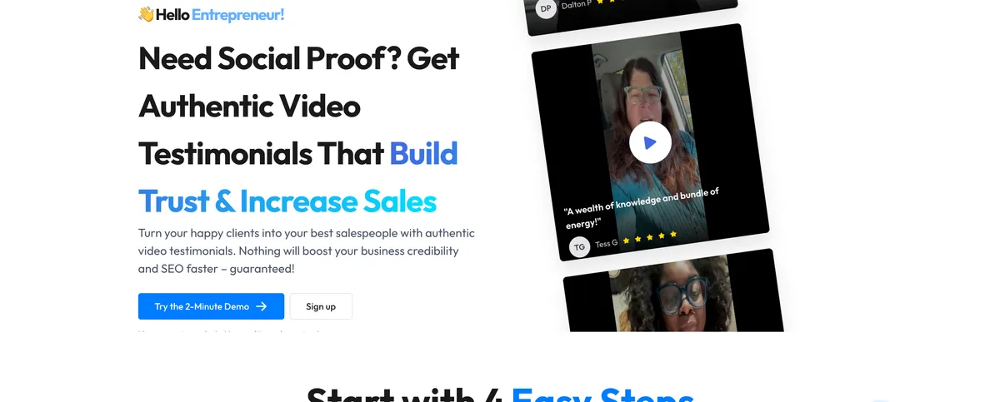
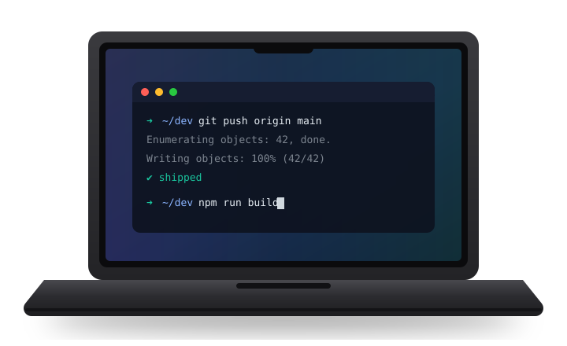

<picture>
  <source media="(prefers-color-scheme: dark)" srcset="./assets/banner-dark.png" />
  <source media="(prefers-color-scheme: light)" srcset="./assets/banner-light.png" />
  
</picture>

# Muhammad Hussain

**Product engineer · Websites · Web apps · AI**

From first idea to launch.

  
  
  

I design and build websites, web apps, and AI features for founders and product teams, and I finish the half-built apps that AI tools left behind. Five years shipping for clients in the UK and US; 25+ products delivered on MERN, Next.js, and TypeScript. Since October 2024 I have been the lead developer on **Minute Master**, an AI meeting-productivity platform for a UK product company: full UI rebrand, the iOS app, LLM-powered minutes and agenda import, and the team's delivery automation.

## Featured work

  
  
  

| Project | What I did | Links |
| --- | --- | --- |
| **Minute Master** | Lead developer for a UK product company: UI rebrand and redesign, iOS app, AI minutes and agenda import, delivery automation. Next.js · TypeScript · GraphQL · PostgreSQL. | [Case study](https://muhammad-hussain.com/work/minute-master) · [Live](https://minute-master.com/) |
| **Samurai Striping** | Contractor website with residential and commercial quote estimators that price the job on the page. React · Vite · Tailwind. | [Case study](https://muhammad-hussain.com/work/samurai-striping) · [Live](https://samuraistriping.com/) |
| **SendMea** | Video-testimonial platform: made the browser recording pipeline reliable across Safari and Chrome and hardened the upload path. React · Firebase · Node.js. | [Case study](https://muhammad-hussain.com/work/sendmea) · [Live](https://sendmea.io/) |

More projects and case studies: [muhammad-hussain.com/#work](https://muhammad-hussain.com/#work)

## Core stack

  
  
  
  
  
  
  
  

## Contact

- **Start a project:** [muhammad-hussain.com/#contact](https://muhammad-hussain.com/#contact) · studio enquiries at [softroid.online/contact](https://softroid.online/contact)
- **Email:** [muhammadhussain99100@gmail.com](mailto:muhammadhussain99100@gmail.com)
- **Elsewhere:** [LinkedIn](https://linkedin.com/in/mhussain007) · [X](https://twitter.com/hussainprov0) · [Stack Overflow](https://stackoverflow.com/users/13398363/muhammad-hussain) · [CV](https://muhammad-hussain.com/Muhammad-Hussain-CV.pdf)

<strong>More: extended tools, marketplaces, gear, stats</strong>

 

**Also comfortable with**

  
  
  
  
  
  
  
  
  
  
  
  

Currently learning Flutter for cross-platform mobile work.

**Marketplaces**

[Upwork](https://www.upwork.com/freelancers/~01a67db2f46b0d7806?viewMode=1) · [Fiverr](https://www.fiverr.com/hussain_code?public_mode=true) (Vetted Pro, 4.9★ across 52 reviews) · [Pay with Wise](https://wise.com/pay/me/muhammadh4357)

**Gear**

MacBook Pro 16″, Apple M2 Max, 32 GB RAM, 1 TB SSD.

**GitHub stats**

  
  

